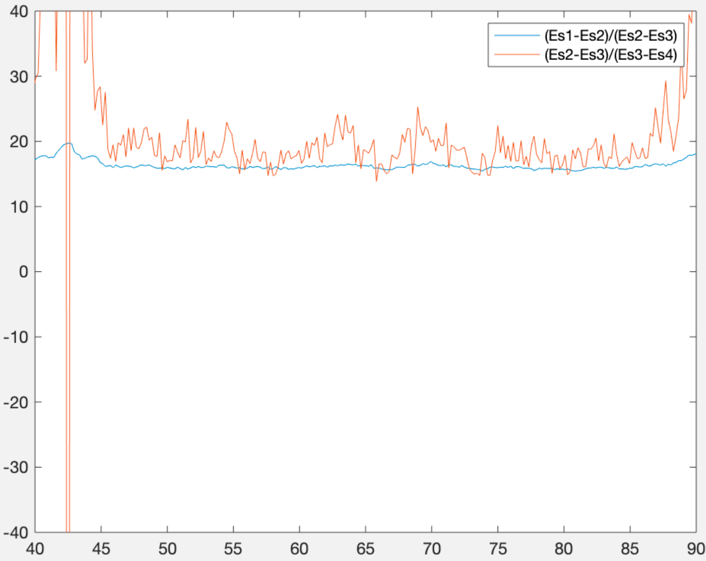
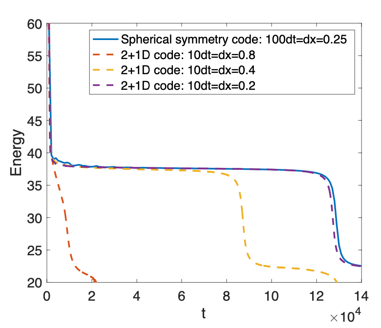
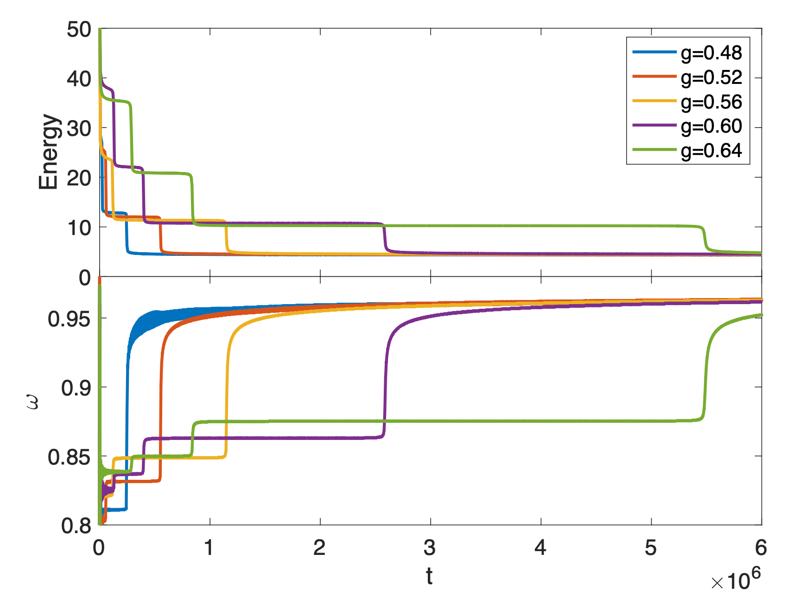
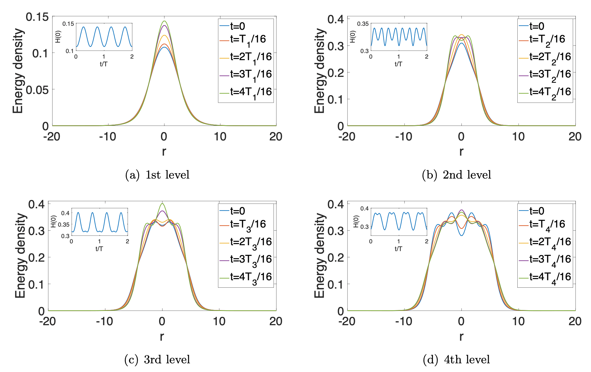
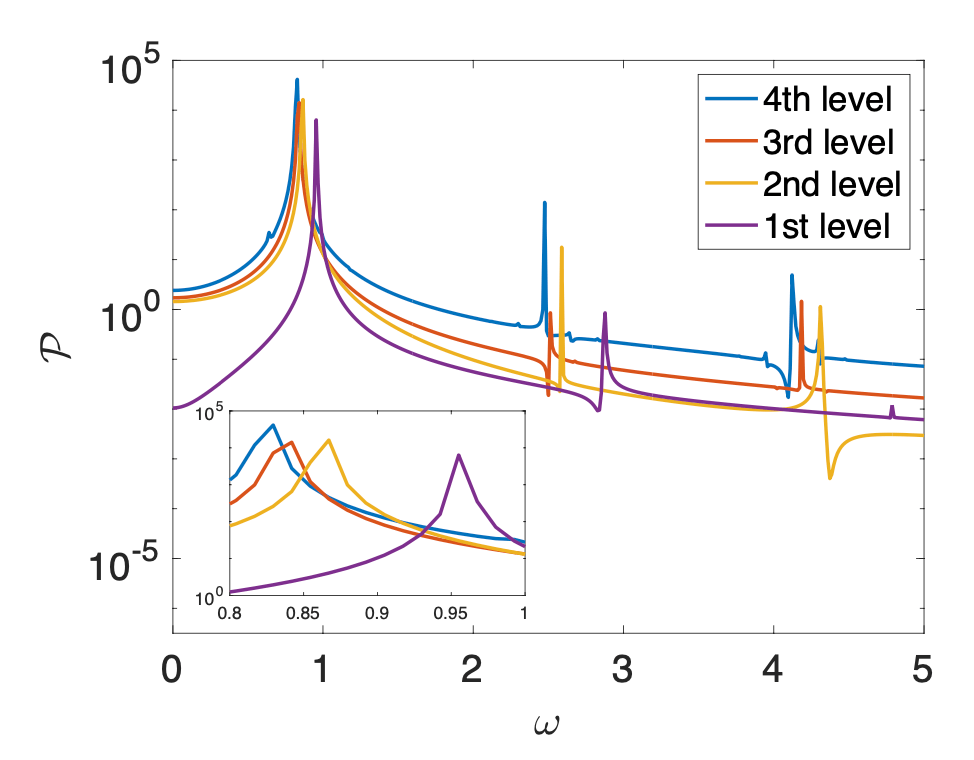

# 基于Python的球对称的级联Oscillon演化模拟


王一杰（PB19020611）

中国科学技术大学，物理学院


摘要：Oscillon是在极早期宇宙研究中极为重要的一种非拓扑孤立子。基于`python`模拟球对称的oscillon，可以四阶高精度地模拟oscillon的多平台级联现象。通过使用文件读写，还可实现数据导出和保存的功能，方便进行后续数据分析。


[toc]

## 背景简介

### Oscillon的意义和研究历史

Oscillon通常存在于允许具有有吸引力的自相互作用的势能的模型中[6, 7]，多年来，人们对Oscillon的特性进行了广泛的研究。事实上，目前的宇宙学观察表明，暴胀势可能非常平缓[8]，并且在暴胀后的再加热期间或早期宇宙的其他类似过程中可以大量产生Oscillon[9-13]。Oscillon的存在会影响大爆炸的热历史，并导致一个以Oscillon为主的时代。早期宇宙中Oscillon的产生通常伴随着随机引力波，这些引力波表征了基础模型的能量尺度和其他特征[14-16]。在全数值相对论中也研究了Oscillon 的 preheating，发现在强重力效应的情况下有时会形成原始黑洞。此外，已在实验室中观察到 2+1 维的Oscillon[17-19]。

### Oscillon的数学背景

我们将关注来自最简单模型的Oscillon，该模型只有一个实标量场$\varphi$在反射$φ → -φ$下不变。 正如我们将看到的，这个简单的模型已经产生了丰富的时间演化和准平稳的复杂结构。 从现代流行的有效场论观点来看，这种$d + 1$ 维的理论是由作用量给出的：
$$
S_{\mathrm{t}}=\int \mathrm{d}^{d+1} \tilde{x}\left(-\frac{1}{2} \partial_{\tilde{\mu}} \varphi \partial^{\tilde{\mu}} \varphi-\frac{1}{2} m^2 \varphi^2+\lambda \varphi^4-g_0 \varphi^6+g_1 \varphi^8+g_2\left(\partial_{\tilde{\mu}} \varphi \partial^{\tilde{\mu}} \varphi\right)^2+\cdots\right).
$$
其中$m$是标量的质量，耦合常数的质量维度为$[λ] = 3−d$，$[g_0] = 4−2d$，$[g_1] = 5−3d$，$ [g_2] = -d−1$ 等等。（可以添加像$∂^4φ^2$和$∂^2φ^4$这样的项，但是这些项可以通过重新定义字段来删除。）为简单起见，我们将在本文中仅考虑$d = 2$的情况，并截断到$φ^6$的数量级，这样作用量重新写为：
$$
S=\frac{m}{2 \lambda} \int \mathrm{d}^3 x \mathcal{L} \equiv \frac{m}{2 \lambda} \int \mathrm{d}^3 x\left(-\frac{1}{2} \partial_\mu \phi \partial^\mu \phi-\frac{1}{2} \phi^2+\frac{1}{2} \phi^4-\frac{1}{2} g \phi^6\right),
$$
其中：
$$
x^\mu=m \tilde{x}^\mu, \quad \phi=\frac{(2 \lambda)^{1 / 2} \varphi}{m}, \quad g=\frac{m^2 g_0}{2 \lambda^2}.
$$
由此，能量密度写为：
$$
\mathcal{H}=\frac{1}{2} \dot{\phi}^2+\frac{1}{2}(\nabla \phi)^2+\frac{1}{2} \phi^2-\frac{1}{2} \phi^4+\frac{1}{2} g \phi^6.
$$
而我们将要用`python`模拟的方程是：
$$
\ddot{\phi}-\nabla^2 \phi+\phi-2 \phi^3+3 g \phi^5=0.
$$
初始条件设定为：
$$
\phi=A e^{-\frac{\left(r^2-a\right)^2}{\sigma^2}}, \quad \dot{\phi}=0.
$$

## 程序设定

### 程序运行逻辑

程序运行逻辑如下流程图所示。

```flow
st=>start: 主程序
op=>operation: 初始化
op2=>operation: 参数设定
op3=>operation: 加载函数
op5=>operation: 输出数据文件
op6=>operation: 输出运行进度
op4=>operation: 执行龙格库塔算法
cond=>condition: 到达运行目标时长?
e=>end: 结束程序

st->op2->op3->op->op5->op4->op5->op6->cond
cond(yes)->e
cond(no)->op4
```


### 格点选择

由于我们主要模拟球对称的Oscillon，故选用极坐标进行格点设置。

#### 奇点问题

在原点$r=0.0$处，该方程存在奇异性，为避免奇异性，模拟的格点选择$r=(0.5+i)\cdot dr,\ i \in Z^+$。

### 边界条件

#### 原点边界条件

原点处使用对称性边界条件，使用程序中`myabs`函数实现。

#### 远场边界条件

远场使用吸收性边界条件，通过下述方程实现：
$$
\left(\partial_t \partial_r+\partial_t^2+\frac{1}{2}+\frac{d-1}{2 r} \partial_t\right) \phi=0.
$$

#### 演化算法

演化使用具有四阶精度的龙格-库塔算法实现。

令初值问题表述如下：
$$
y^{\prime}=f(t, y), \quad y\left(t_0\right)=y_0.
$$
则，对于该问题的RK4由如下方程给出:
$$
y_{n+1}=y_n+\frac{h}{6}\left(k_1+2 k_2+2 k_3+k_4\right),
$$
其中：
$$
\begin{aligned}
&k_1=f\left(t_n, y_n\right), \\
&k_2=f\left(t_n+\frac{h}{2}, y_n+\frac{h}{2} k_1\right), \\
&k_3=f\left(t_n+\frac{h}{2}, y_n+\frac{h}{2} k_2\right), \\
&k_4=f\left(t_n+h, y_n+h k_3\right).
\end{aligned}
$$

### 功能实现

实现的功能包括：

| 功能                                                         | 对应函数                                                     |
| ------------------------------------------------------------ | ------------------------------------------------------------ |
| 势能和势能偏导数计算                                         | `potenial(phi)`和`pdpotenial(phi)`                           |
| 原点避开奇点的对称性边界条件                                 | `myabs(i)`                                                   |
| 场对半径的一阶和二阶偏导数（四阶精度）                       | `pdr(phi,i)`和`pd2r(phi,i)`                                  |
| 演化方程函数（内置远场吸收性边界条件）                       | `formular(r,phi,pdtphi,pdrphi,pd2rphi,pdrtphi,i)`            |
| 能量计算函数                                                 | `energycal(r,dr,phi,pdtphi,pdrphi)`和`energycallim(r,dr,phi,pdtphi,pdrphi)` |
| 初始化函数                                                   | `initialize(phi, pdtphi, r)`                                 |
| 场输出函数，输出参数包括$\phi$, $\partial_t\phi$, $\partial_r\phi$, | `outputphi(j,phi,peroid)`， `outputpdtphi(j,phi,peroid)`和`outputpdrphi(j,phi,peroid)` |
| 格点输出函数，输出参数包括`r`, `rT`                          | `outputr(r)`和`outputrT(rT)`                                 |
| 能量输出函数                                                 | `outputenergy(j,energy,energylim,peroid)`                    |
| 周期输出函数                                                 | `outputperoid(j,T,peroid)`                                   |

### 程序输入和输出

#### 程序输入

输入参数包括

`R`：计算域半径。

`calR`：可选的总能量计算域，请参阅`energylim.dat`输出文件解释。

`zoombeta`： 精度参数，越高，精度越高。

`sz`：网格数量。

`dr`：空间步长。

`cfl`：`dt`/`dr`。

`dt`：时间步长。

`tnum`：步数。

`tlength`：总计算时间长度；

`Dim`：计算域维度。

`g`：势能无量纲参数。

`A`：初始条件设置参数。

`a`：初始条件设置参数。

`sigma`：初始条件设置参数。

`peroid`：输出周期控制参数，当`timestep/peroid`=`ceil(timestep/peroid)`运行输出函数。（不是场的周期!）

`pi`：$\pi$。

`numofrT`：在计算域中均匀设置`numofrT`点，以输出对应点的场周期。

#### 程序输出文件

`energy.dat`：此文件输出总能量，第一列输出时间，第二列输出完整的计算域总能量。

`energylim.dat`：此文件输出部分能量，第一列输出时间，第二列输出半径$r<calR$ 空间的能量和。

`r.dat`：此文件输出所有网格点位置坐标。

`pdrphi.dat`：此文件输出所有网格上的$\partial_r\phi$，每行的第一列输出时间，然后输出$\partial_r\phi$在那个时间点的所有格点上的值。

`pdtphi.dat`：此文件输出所有网格上的$\partial_t\phi$，每行的第一列输出时间，然后输出$\partial_t\phi$在那个时间点的所有格点上的值。

`phi.dat`：此文件输出所有网格上的$\phi$，每行的第一列输出时间，然后输出$\phi$在那个时间点的所有格点上的值。

`rT.dat`：此文件输出位置半径将输出这些点的场周期。

`T.dat`：此文件输出与`rT.dat`文件中的点相对应的场周期。

## 程序运行测试

### 收敛性测试

程序收敛性可以用如下公式表示：
$$
2^k:=\Omega \approx \frac{E_1-E_2}{E_2-E_3} \approx \frac{E_2-E_3}{E_3-E_4}.
$$
其中，$k$表示精度阶数，$E_i$的下标$i$表示在参数`zoombeta=i`的情况下的总能量值。如下图所示，可见$\Omega\approx 16$。故该程序达到四阶精度



### 交叉测试

该程序运行结果还可和其他程序进行交叉验证，我们选用使用c语言，笛卡尔坐标的程序进行验证。下图可见，随着步长缩短，精度提高，两程序结果收敛，说明程序运行正确。且可以看出，本程序（图中Spherical symmetry code）收敛快于使用笛卡尔坐标的程序。



## 程序创新性描述

### 球对称坐标选择

之前使用的程序为2+1维笛卡尔坐标程序，具有普适性，但在具体研究上，现开发的极坐标代码将二维问题简化为一维，对此类特定问题，运行速度和效率大大提高。

### 吸收性边界条件

使用吸收性边界条件使得程序演化的中心Oscillon不受到外界影响（诸如反射波），更加符合实际物理过程。

### 高精度运算

求导和演化程序均使用4阶高精度的差分法和龙格-库塔法。运算精度高，收敛快，使得程序长时间运行结果可靠。

## 程序运行结果

### 命令行输出

本程序拥有在命令行输出运行进度的能力，输出形式如下：

```
Time = 0.0 Beacon = 0.0 Energy =  114.9906288349665
Time = 0.5 Beacon = 2.5e-05 Energy =  115.00205891735517
Time = 1.0 Beacon = 5e-05 Energy =  115.00385910801732
Time = 1.5 Beacon = 7.5e-05 Energy =  114.99950392114546
Time = 2.0 Beacon = 0.0001 Energy =  114.98817907700744
Time = 2.5 Beacon = 0.000125 Energy =  114.9785206135704
Time = 3.0 Beacon = 0.00015 Energy =  114.97737618683938
Time = 3.5 Beacon = 0.000175 Energy =  114.98289824416085
```

`Time`代表已经计算的场演化时间总长，`Beacon`代表计算完成进度（`Beacon=1.0`则计算完成），`Energy`实时输出系统总能量，用于观察演化是否出现bug。

### 输出文件分析

#### 能量和周期的平台：`energy.dat`和`T.dat`



输出结果如上图所示，可见在不同的参数`g`都能出现多平台的现象。

#### 场的分布：`phi.dat`, `pdtphi.dat`和`pdrphi.dat`

通过对各个场值的分析，我们很容易就能画出场的演化和能量的演化图等，如下图所示：



上图是Oscillon 4 个平台能级的能量密度的演化。$T_1$、$T_2$、$T_3$、$T_4$ 分别为振荡器中心场$\phi$的振荡周期，其中$T_1$为第一能级。能量密度的振荡周期是场相应周期的一半。插图显示了$r = 0$时能量密度的时间演化。

#### Fourier频谱分析：`phi.dat`

关于不同平台的场的Fourier频谱，则可以使用Fourier频谱对其进行展开分析：
$$
\mathcal{P}=\left|\tilde{\phi}\left(\omega, \mathbf{x}_0\right)\right|^2, \quad \text { where } \tilde{\phi}\left(\omega, \mathbf{x}_0\right)=\int_{t_a}^{t_b} \mathrm{~d} t e^{-i \omega t} \phi\left(t, \mathbf{x}_0\right).
$$
得到的结果如下图所示:



该图画出了Oscillon中心标量场的傅里叶谱$\mathcal{P}$。插图突出了$ω = 1 $附近的主峰。较高频率的峰值几乎是$ω = 1$附近的基频的奇数倍。该图的参数为$g=0.60$, $A=1.0$, $a=81$和$σ=90$，采样时间为$t_a = 2.1 × 10^4$, $ 1.75 × 10^5$, $ 1.75 × 10^6$, $ 3.9 × 10^6$。

## 学习心得

### 关于Python

经过一学期的学习，很容易发现Python众多优点。

#### 优点

首先，Python语言力求代码简洁、优美。在Python语言中，采用缩进来标识代码块，通过减少无用的大括号，去除语句末尾的分号等视觉杂讯，使得代码的可读性显著提高。

其次，Python拥有丰富的库资源，包含了解决各种问题的类库。无论实现什么功能，都有现成的类库可以使用。同时，因为有了丰富强大的类库，所以，Python的开发效率能够显著提高。


当然，Python也有一些不可忽视的缺点。

#### 缺点

Python的执行速度不够快。但是，因为Python特别容易和C结合起来，因此，我们可以通过分离一部分需要优化速度的应用，将其转换为编译好的扩展，并在整个系统中使用Python脚本将这部分应用连接起来，以提高程序的整体效率。

Python2与Python3不兼容。因为Python没有向后兼容，这点在macOS系统上尤为突出（因为macOS自带Python为Python2，要想正确在命令行中调用Python3，需要输入`python3`，而不是常见的`python`）。

#### 总结

无论如何，Python丰富的库和自然的语言是它巨大的优势和吸引人们学习，使用的原因之一。我也会在之后的学习中，尝试使用Python的更多功能，和其他语言一起取长补短，精进自己的编程能力。

### 关于建议

#### 作业提交文件格式

程序作业提交可否支持更多的格式？诸如LaTeX？这样或许能在文档编写上遇到特殊公式时更加方便。

#### 作业编写程序

推荐老师也可教授学生使用另一种html文件编写方法：使用Typora软件用Markdown语言编写文档，之后选择导出为html，操作难度更低。

## 附录

### 附录1: 源代码（共计258行）

代码使用库`numpy`，设定参数均在代码头部，可以方便地自定义。编写函数17个，输出文件(.dat文件)8个。

```python
import numpy as np
np.set_printoptions(linewidth=1000000000000000000000)
R = 128
calR = 20
zoombeta=2;
sz=256*zoombeta;
dr=R/sz;
cfl=0.01;
dt=dr*cfl;
tnum=8000000;
tlength=tnum*dt;
Dim=2;
g=0.60;
A=1.0;
a=81;
sigma=90;
peroid=200;
pi=3.1415926535898;
numofrT=16;

def potenial(phi):
    return (0.5 * (phi * phi - phi * phi * phi * phi + g * phi * phi * phi * phi * phi * phi))


def pdpotenial(phi):
    return (1.0 * phi - 2.0 * phi * phi * phi + 3.0 * g * phi * phi * phi * phi * phi)


def myabs(i):
    if i>=0:
        return i
    else:
        return -i-1


def pdr(phi, i):
    if sz-i >= 2:
        return ((phi[myabs(i - 2)] - 8.0 * phi[myabs(i - 1)] + 8.0 * phi[myabs(i + 1)] - phi[myabs(i + 2)]) / (
                    12.0 * dr))
    else:
        return ((3.0 * phi[i - 4] - 16.0 * phi[i - 3] + 36.0 * phi[i - 2] - 48.0 * phi[i - 1] + 25.0 * phi[i]) / (
                    12.0 * dr))


def pd2r(phi, i ):
    if sz-i >=2:
        return ((-phi[myabs(i - 2)] + 16.0 * phi[myabs(i - 1)] - 30.0 * phi[myabs(i)] + 16.0 * phi[myabs(i + 1)] - phi[
            myabs(i + 2)]) / (12.0 * dr * dr))
    else:
        return ((-10 * phi[i - 5] + 61.0 * phi[i - 4] - 156.0 * phi[i - 3] + 214.0 * phi[i - 2] - 154.0 * phi[
            i - 1] + 45.0 * phi[i]) / (12.0 * dr * dr))


def outputphi(j, phi, peroid):
    if np.ceil(j/peroid) == j/peroid:
        f = open("phi.dat", mode='a', encoding="utf-8")
        f.write(str(j*dt) + ' ')
        for i in range(len(phi)):
            f.write(str(phi[i]) + ' ')
        f.write('\n')
        f.close()


def outputpdtphi(j, pdtphi, peroid):
    if np.ceil(j/peroid) == j/peroid:
        f = open("pdtphi.dat", mode='a', encoding="utf-8")
        f.write(str(j * dt) + ' ')
        for i in range(len(pdtphi)):
            f.write(str(pdtphi[i]) + ' ')
        f.write('\n')
        f.close()


def outputpdrphi(j, pdrphi, peroid):
    if np.ceil(j/peroid) == j/peroid:
        f = open("pdrphi.dat", mode='a', encoding="utf-8")
        f.write(str(j * dt) + ' ')
        for i in range(len(pdrphi)):
            f.write(str(pdrphi[i]) + ' ')
        f.write('\n')
        f.close()


def outputr(r):
    f = open("r.dat", mode='a', encoding="utf-8")
    for i in range(len(r)):
        f.write(str(r[i])+' ')
    f.write('\n')
    f.close()


def outputrT(rT):
    f = open("rT.dat", mode='a', encoding="utf-8")
    for i in range(len(rT)):
        f.write(str(rT[i]) + ' ')
    f.write('\n')
    f.close()


def formular(r, phi, pdtphi, pdrphi, pd2rphi, pdrtphi, i):
    if sz-i <= 2:
        return (-0.5*phi[i]-pdrtphi[i]-((Dim-1.0)/(2.0*r[i]))*pdtphi[i])
    else:
        return (pd2rphi[i]+((Dim-1.0)/(r[i]))*pdrphi[i]-pdpotenial(phi[i]))


def energycal(r, dr, phi, pdtphi, pdrphi):
    Energy = 0
    for i in range(sz+1):
        Energy = Energy + (
                    0.5 * pdrphi[i] * pdrphi[i] + 0.5 * pdtphi[i] * pdtphi[i] + 0.5 * phi[i] * phi[i] - 0.5 * phi[i] *
                    phi[i] * phi[i] * phi[i] + 0.5 * g * phi[i] * phi[i] * phi[i] * phi[i] * phi[i] * phi[i]) * 2 * pi * \
                 r[i] * dr
    return Energy


def energycallim(r, dr, phi, pdtphi, pdrphi):
    Energy = 0
    for i in range(int(np.ceil(calR/dr) + 1)):
        Energy = Energy + (
                0.5 * pdrphi[i] * pdrphi[i] + 0.5 * pdtphi[i] * pdtphi[i] + 0.5 * phi[i] * phi[i] - 0.5 * phi[i] *
                phi[i] * phi[i] * phi[i] + 0.5 * g * phi[i] * phi[i] * phi[i] * phi[i] * phi[i] * phi[i]) * 2 * pi * \
                 r[i] * dr
    return Energy


def outputenergy(j, energy, energylim, peroid):
    if np.ceil(j / peroid) == j / peroid:
        f = open("energy.dat", mode='a', encoding="utf-8")
        f.write(str(j * dt) + ' ')
        f.write(str(energy) + ' ')
        f.write('\n')
        f.close()

        f = open("energylim.dat", mode='a', encoding="utf-8")
        f.write(str(j * dt) + ' ')
        f.write(str(energylim) + ' ')
        f.write('\n')
        f.close()


def initialize(phi, pdtphi, r):
    for i in range(sz + 1):
        phi[i]=A*np.exp(-pow((r[i])*(r[i])-a,2.0)/(sigma*sigma))
        pdtphi[i] = 0
    return phi,pdtphi


def peroidcal(phi, tempTphi, j, tempT1, tempT2, T):
    for i in range(numofrT + 1):
        if ((phi[int(i*(sz/numofrT))]<=0) and (tempTphi[int(i*(sz/numofrT))]>=0)):
            tempT2[i] = j * dt
            T[i] = tempT2[i] - tempT1[i]
            tempT1[i] = tempT2[i]


def outputperoid(j, T, peroid):
    if np.ceil(j / peroid) == (j / peroid):
        f = open("T.dat", mode='a', encoding="utf-8")
        f.write(str(j * dt) + ' ')
        for i in range(len(T)):
            f.write(str(T[i]) + ' ')
        f.write('\n')
        f.close()


phi = np.zeros(sz+1)
r = np.zeros(sz+1)
pdrphi = np.zeros(sz+1)
pdtphi = np.zeros(sz+1)
pd2tphi = np.zeros(sz+1)
pd2rphi = np.zeros(sz+1)
pdrtphi = np.zeros(sz+1)
temphi1 = np.zeros(sz+1)
tempdtphi = np.zeros(sz+1)
tempdrphi = np.zeros(sz+1)
tempd2rphi = np.zeros(sz+1)
tempdrtphi = np.zeros(sz+1)
temphi2 = np.zeros(sz+1)
k1 = np.zeros(sz+1)
k2 = np.zeros(sz+1)
k3 = np.zeros(sz+1)
k4 = np.zeros(sz+1)
k1t = np.zeros(sz+1)
k2t = np.zeros(sz+1)
k3t = np.zeros(sz+1)
k4t = np.zeros(sz+1)
y1 = np.zeros(sz+1)
y2 = np.zeros(sz+1)
y3 = np.zeros(sz+1)
y1t = np.zeros(sz+1)
y2t = np.zeros(sz+1)
y3t = np.zeros(sz+1)

rT = np.zeros(numofrT+1)
tempT1 = np.zeros(numofrT+1)
tempT2 = np.zeros(numofrT+1)
T = np.zeros(numofrT+1)

for i in range(sz + 1):
    r[i] = (i + 0.5) * dr

for i in range(numofrT + 1):
    rT[i] = r[int(i*np.ceil(sz/numofrT))]


outputr(r)
outputrT(rT)

initialize(phi, pdtphi, r)

for j in range(tnum):
    for i in range(sz + 1):
        pdrphi[i] = pdr(phi, i)
        pd2rphi[i] = pd2r(phi, i)
        pdrtphi[i] = pdr(pdtphi, i)
        pd2tphi[i] = formular(r, phi, pdtphi, pdrphi, pd2rphi, pdrtphi, i)
        temphi1[i] = phi[i]
        tempdtphi[i] = pdtphi[i]
    outputphi(j, phi, peroid)
    outputphi(j, phi, peroid)
    outputpdtphi(j, pdtphi, peroid)
    outputpdrphi(j, pdrphi, peroid)
    outputenergy(j, energycal(r, dr, phi, pdtphi, pdrphi), energycallim(r, dr, phi, pdtphi, pdrphi), peroid)
    outputperoid(j, T, peroid)
    for i in range(sz + 1):
        k1[i] = dt * pdtphi[i]
        k1t[i] = dt * formular(r, phi, pdtphi, pdrphi, pd2rphi, pdrtphi, i)
        y1[i] = phi[i] + 0.5 * k1[i]
        y1t[i] = pdtphi[i] + 0.5 * k1t[i]
    for i in range(sz + 1):
        tempdrphi[i] = pdr(y1, i)
        tempd2rphi[i] = pd2r(y1, i)
        tempdrtphi[i] = pdr(y1t, i)
        k2[i] = dt * y1t[i]
        k2t[i] = dt * formular(r, y1, y1t, tempdrphi, tempd2rphi, tempdrtphi, i)
        y2[i] = phi[i] + 0.5 * k2[i]
        y2t[i] = pdtphi[i] + 0.5 * k2t[i]
    for i in range(sz + 1):
        tempdrphi[i] = pdr(y2, i)
        tempd2rphi[i] = pd2r(y2, i)
        tempdrtphi[i] = pdr(y2t, i)
        k3[i] = dt * y2t[i]
        k3t[i] = dt * formular(r, y2, y2t, tempdrphi, tempd2rphi, tempdrtphi, i)
        y3[i] = phi[i] + k3[i]
        y3t[i] = pdtphi[i] + k3t[i]
    for i in range(sz + 1):
        tempdrphi[i] = pdr(y3, i)
        tempd2rphi[i] = pd2r(y3, i)
        tempdrtphi[i] = pdr(y3t, i)
        k4[i] = dt * y3t[i]
        k4t[i] = dt * formular(r, y3, y3t, tempdrphi, tempd2rphi, tempdrtphi, i)
        phi[i] = phi[i] + (k1[i] + 2.0 * k2[i] + 2.0 * k3[i] + k4[i]) / 6.0
        pdtphi[i] = pdtphi[i] + (k1t[i] + 2.0 * k2t[i] + 2.0 * k3t[i] + k4t[i]) / 6.0
    peroidcal(phi, temphi1, j, tempT1, tempT2, T)
    if j/peroid == np.ceil(j/peroid):
        print("Time =",j*dt,'Beacon =',j/tnum,'Energy = ',energycallim(r, dr, phi, pdtphi, pdrphi))

```

### 附录2: 参考文献

1. Wang, Yi-Jie, Qi-Xin Xie, and Shuang-Yong Zhou. "Excited oscillons: cascading levels and higher multipoles." *arXiv preprint arXiv:2210.04969* (2022).

2. Zhang, Hong-Yi, et al. "Classical decay rates of oscillons." *Journal of Cosmology and Astroparticle Physics* 2020.07 (2020): 055.

3. Mukaida, Kyohei, Masahiro Takimoto, and Masaki Yamada. "On longevity of I-ball/oscillon." *Journal of High Energy Physics* 2017.3 (2017): 1-31.

4. Saffin, Paul M., and Anders Tranberg. "Oscillons and quasi-breathers in D+ 1 dimensions." *Journal of High Energy Physics* 2007.01 (2007): 030.

5. Salmi, Petja, and Mark Hindmarsh. "Radiation and relaxation of oscillons." *Physical Review D* 85.8 (2012): 085033.

6. S. R. Coleman, Q-balls, Nucl. Phys. B 262 (1985) 263.

7. T. D. Lee and Y. Pang, Nontopological solitons, Phys. Rept. 221 (1992) 251–350.

8. Planck collaboration, Y. Akrami et al., Planck 2018 results. X. Constraints on inflation, Astron. Astrophys. 641 (2020) A10, [1807.06211].

9. M. Broadhead and J. McDonald, Simulations of the end of supersymmetric hybrid inflation and

   non-topological soliton formation, Phys. Rev. D 72 (2005) 043519, [hep-ph/0503081].

10. M. Gleiser, Oscillons in scalar field theories: Applications in higher dimensions and inflation,

    Int. J. Mod. Phys. D 16 (2007) 219–229, [hep-th/0602187].

11. N. Graham and N. Stamatopoulos, Unnatural Oscillon Lifetimes in an Expanding Background,

    Phys. Lett. B 639 (2006) 541–545, [hep-th/0604134].

12. E. Farhi, N. Graham, A. H. Guth, N. Iqbal, R. R. Rosales and N. Stamatopoulos, Emergence of

    Oscillons in an Expanding Background, Phys. Rev. D 77 (2008) 085019, [0712.3034].

13. M. A. Amin and D. Shirokoff, Flat-top oscillons in an expanding universe.

14. Z. Nazari, M. Cicoli, K. Clough and F. Muia, Oscillon collapse to black holes, JCAP 05 (2021) 027, [2010.05933].

15. X.-X. Kou, C. Tian and S.-Y. Zhou, Oscillon Preheating in Full General Relativity, Class. Quant. Grav. 38 (2021) 045005, [1912.09658].

16. X.-X. Kou, J. B. Mertens, C. Tian and S.-Y. Zhou, Gravitational waves from fully general relativistic oscillon preheating, Phys. Rev. D 105 (2022) 123505, [2112.07626].

17. P. B. Umbanhowar, F. Melo and H. L. Swinney, Localized excitations in a vertically vibrated granular layer, Nature 382 (1996) 793–796.

18. O. Lioubashevski, Y. Hamiel, A. Agnon, Z. Reches and J. Fineberg, Oscillons and propagating solitary waves in a vertically vibrated colloidal suspension, Physical review letters 83 (1999) 3190.

19. H. Arbell and J. Fineberg, Temporally harmonic oscillons in newtonian fluids, Physical Review Letters 85 (2000) 756.

20. 知乎用户, 链接：https://www.zhihu.com/question/62909728/answer/794967277, 来源：知乎