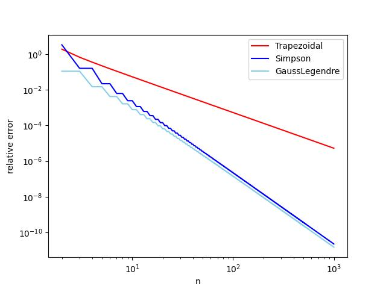

# Homework 1

## Exercise 1

### 积分的收敛性

选择一个已知积分的函数，使用第五章习题2的三种方法计算其数值定积分。编写程序从一个等比数列中依次选取$n$，绘制三种方法的计算结果和精确结果之间的相对误差随变化的情况。绘图时两个坐标轴都使用对数尺度，并标注图例。

#### 源代码

```python
import matplotlib.pyplot as plt
import numpy
import numpy as np
import math
print("This is a python code for homework9-1: Error Convergence")


class Integrator(object):
    def __init__(self, a, b, n):
        self.a, self.b, self.n = a, b, n
        self.points, self.weights = self.compute_points()

    def compute_points(self):
        raise NotImplementedError('no rule in class %s' \
                                   % self.__class__.__name__)
    def integrate(self, f):
        sum = 0
        for i in range(self.n+1):
            sum = sum + self.weights[i]*f(self.points[i])
        return sum


class Trapezoidal(Integrator):
    def compute_points(self):
        p = list()
        w = list()
        for i in range(self.n+1):
            h = (self.b-self.a)/(self.n)
            p.append(self.a+i*h)
            if i == 0:
                w.append(h / 2)
            elif i == self.n:
                w.append(h / 2)
            else:
                w.append(h)
        return p, w


class Simpson(Integrator):
    def compute_points(self):
        p = list()
        w = list()
        if self.n%2 == 1:
            self.n = self.n+1
        for i in range(self.n+1):
            h = (self.b-self.a)/(self.n)
            p.append(self.a+i*h)
            if i == 0:
                w.append(h / 3)
            elif i == self.n:
                w.append(h / 3)
            elif i%2 == 0:
                w.append(2*h/3)
            else:
                w.append(4 * h / 3)
        return p, w


class GaussLegendre(Integrator):
    def compute_points(self):
        p = list()
        w = list()
        if self.n%2 == 0:
            self.n = self.n+1
        for i in range(self.n+1):
            h = 2*(self.b-self.a)/(self.n+1)
            if i%2 == 0:
                p.append(self.a+(i+1)*h/2-math.sqrt(3)*h/6)
            else:
                p.append(self.a+i*h/2+math.sqrt(3)*h/6)
            w.append(h/2)
        return p, w

# A linear function will be exactly integrated by all
# the methods, so such an f is the candidate for testing
# the implementations


def f(x): return numpy.sin(x)


def F(x): return -numpy.cos(x)


a = 2; b = 10;
I_exact = F(b) - F(a)

I_T = []
error_T = []
I_S = []
error_S = []
I_G = []
error_G = []
nC = 1000
for n in range(2, nC):
    integrator = Trapezoidal(a, b, n)
    ans = integrator.integrate(f)
    I_T.append(ans)
    error_T.append(abs(ans-I_exact)/I_exact)
for n in range(2, nC):
    integrator = Simpson(a, b, n)
    ans = integrator.integrate(f)
    I_S.append(ans)
    error_S.append(abs(ans-I_exact)/I_exact)
for n in range(2, nC):
    integrator = GaussLegendre(a, b, n)
    ans = integrator.integrate(f)
    I_G.append(ans)
    error_G.append(abs(ans-I_exact)/I_exact)
nC = np.arange(2, 1000, 1)
error_T = np.array(error_T)
error_G = np.array(error_G)
error_S = np.array(error_S)
plt.loglog()
plt.plot(nC, error_T, color = 'red', label = 'Trapezoidal')
plt.plot(nC, error_S, color = 'blue', label = 'Simpson')
plt.plot(nC, error_G, color = 'skyblue', label = 'GaussLegendre')
plt.ylabel('relative error')
plt.xlabel('n')
plt.legend()
plt.savefig('hw9_1.jpg')

```

#### 运行结果

```
/usr/local/bin/python3.9 "/Users/wangyijie/Library/Mobile Documents/com~apple~CloudDocs/Study_in_USTC/杂事/python科学计算/hw9/hw9_2.py"

This is a python code for homework9-2: Sorting time

Process finished with exit code 0
```



运行得到图片如上，可见代码运行正确。

## Exercise 2

### 排序算法运行时间

#### 题目

绘制第八章习题2的三种排序算法的运行时间随列表长度变化的情况。

#### 源代码

```python
import matplotlib.pyplot as plt
import timeit
print("This is a python code for homework9-2: Sorting time")

set_up = """
import random
def random_int_list(start, stop, length):
    start, stop = (int(start), int(stop)) if start <= stop else (int(stop), int(start))
    length = int(abs(length)) if length else 0
    random_list = []
    for i in range(length):
        random_list.append(random.randint(start, stop))
    return random_list


s1 = random_int_list(1, 100, 100)
s2 = random_int_list(1, 100, 200)
s3 = random_int_list(1, 100, 300)
s4 = random_int_list(1, 100, 400)
s5 = random_int_list(1, 100, 500)
s6 = random_int_list(1, 100, 600)
s7 = random_int_list(1, 100, 700)
s8 = random_int_list(1, 100, 800)
s9 = random_int_list(1, 100, 900)
s10 = random_int_list(1, 100, 1000)


def insertion_sort(s):
    n = len(s)
    for i in range(1, n):
        value = s[i]
        pos = i
        while pos > 0 and value < s[pos - 1] :
            s[pos] = s[pos - 1]
            pos -= 1
        s[pos] = value
    return s


def merge_ordered_lists(s1, s2):
    t = []
    i = j = 0
    while i < len(s1) and j < len(s2):
        if s1[i] < s2[j]:
            t.append(s1[i]); i += 1
        else:
            t.append(s2[j]); j += 1
    t += s1[i:]
    t += s2[j:]
    return t


def merge_sort(s):
    if len(s) <= 1:
        return s
    mid = len(s) // 2
    left = merge_sort(s[:mid])
    right = merge_sort(s[mid:])
    return merge_ordered_lists(left, right)


def qsort(s):
    if len(s) <= 1: return s
    s1 = [i for i in s if i < s[0]]
    s2 = [i for i in s if i > s[0]]
    s0 = [i for i in s if i == s[0]]
    return qsort(s1) + s0 + qsort(s2)
"""

t1q = """
qsort(s1)
"""
t2q = """
qsort(s2)
"""
t3q = """
qsort(s3)
"""
t4q = """
qsort(s4)
"""
t5q = """
qsort(s5)
"""
t6q = """
qsort(s6)
"""
t7q = """
qsort(s7)
"""
t8q = """
qsort(s8)
"""
t9q = """
qsort(s9)
"""
t10q = """
qsort(s10)
"""
t1i = """
insertion_sort(s1)
"""
t2i = """
insertion_sort(s2)
"""
t3i = """
insertion_sort(s3)
"""
t4i = """
insertion_sort(s4)
"""
t5i = """
insertion_sort(s5)
"""
t6i = """
insertion_sort(s6)
"""
t7i = """
insertion_sort(s7)
"""
t8i = """
insertion_sort(s8)
"""
t9i = """
insertion_sort(s9)
"""
t10i = """
insertion_sort(s10)
"""
t1m = """
merge_sort(s1)
"""
t2m = """
merge_sort(s2)
"""
t3m = """
merge_sort(s3)
"""
t4m = """
merge_sort(s4)
"""
t5m = """
merge_sort(s5)
"""
t6m = """
merge_sort(s6)
"""
t7m = """
merge_sort(s7)
"""
t8m = """
merge_sort(s8)
"""
t9m = """
merge_sort(s9)
"""
t10m = """
merge_sort(s10)
"""

N = 10

tti = []
ttm = []
ttq = []

tti.append(timeit.timeit(stmt=t1i, setup=set_up, number=N)/N)
tti.append(timeit.timeit(stmt=t2i, setup=set_up, number=N)/N)
tti.append(timeit.timeit(stmt=t3i, setup=set_up, number=N)/N)
tti.append(timeit.timeit(stmt=t4i, setup=set_up, number=N)/N)
tti.append(timeit.timeit(stmt=t5i, setup=set_up, number=N)/N)
tti.append(timeit.timeit(stmt=t6i, setup=set_up, number=N)/N)
tti.append(timeit.timeit(stmt=t7i, setup=set_up, number=N)/N)
tti.append(timeit.timeit(stmt=t8i, setup=set_up, number=N)/N)
tti.append(timeit.timeit(stmt=t9i, setup=set_up, number=N)/N)
tti.append(timeit.timeit(stmt=t10i, setup=set_up, number=N)/N)

ttm.append(timeit.timeit(stmt=t1m, setup=set_up, number=N)/N)
ttm.append(timeit.timeit(stmt=t2m, setup=set_up, number=N)/N)
ttm.append(timeit.timeit(stmt=t3m, setup=set_up, number=N)/N)
ttm.append(timeit.timeit(stmt=t4m, setup=set_up, number=N)/N)
ttm.append(timeit.timeit(stmt=t5m, setup=set_up, number=N)/N)
ttm.append(timeit.timeit(stmt=t6m, setup=set_up, number=N)/N)
ttm.append(timeit.timeit(stmt=t7m, setup=set_up, number=N)/N)
ttm.append(timeit.timeit(stmt=t8m, setup=set_up, number=N)/N)
ttm.append(timeit.timeit(stmt=t9m, setup=set_up, number=N)/N)
ttm.append(timeit.timeit(stmt=t10m, setup=set_up, number=N)/N)

ttq.append(timeit.timeit(stmt=t1q, setup=set_up, number=N)/N)
ttq.append(timeit.timeit(stmt=t2q, setup=set_up, number=N)/N)
ttq.append(timeit.timeit(stmt=t3q, setup=set_up, number=N)/N)
ttq.append(timeit.timeit(stmt=t4q, setup=set_up, number=N)/N)
ttq.append(timeit.timeit(stmt=t5q, setup=set_up, number=N)/N)
ttq.append(timeit.timeit(stmt=t6q, setup=set_up, number=N)/N)
ttq.append(timeit.timeit(stmt=t7q, setup=set_up, number=N)/N)
ttq.append(timeit.timeit(stmt=t8q, setup=set_up, number=N)/N)
ttq.append(timeit.timeit(stmt=t9q, setup=set_up, number=N)/N)
ttq.append(timeit.timeit(stmt=t10q, setup=set_up, number=N)/N)

nC = [1, 2, 3, 4, 5, 6, 7, 8, 9, 10]

plt.plot(nC, tti, color = 'red', label = 'insertion sort')
plt.plot(nC, ttm, color = 'blue', label = 'merge sort')
plt.plot(nC, ttq, color = 'skyblue', label = 'quick sort')
plt.ylabel('running time')
plt.xlabel('n')
plt.legend()
plt.savefig('hw9_2.jpg')

```

#### 运行结果

```
/usr/local/bin/python3.9 "/Users/wangyijie/Library/Mobile Documents/com~apple~CloudDocs/Study_in_USTC/杂事/python科学计算/hw9/hw9_2.py"

This is a python code for homework9-2: Sorting time

Process finished with exit code 0
```


运行得到图片如上，可见代码运行正确。